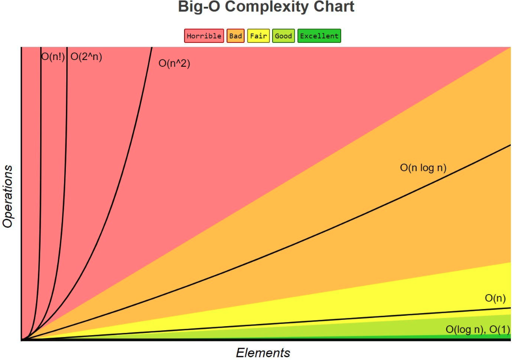
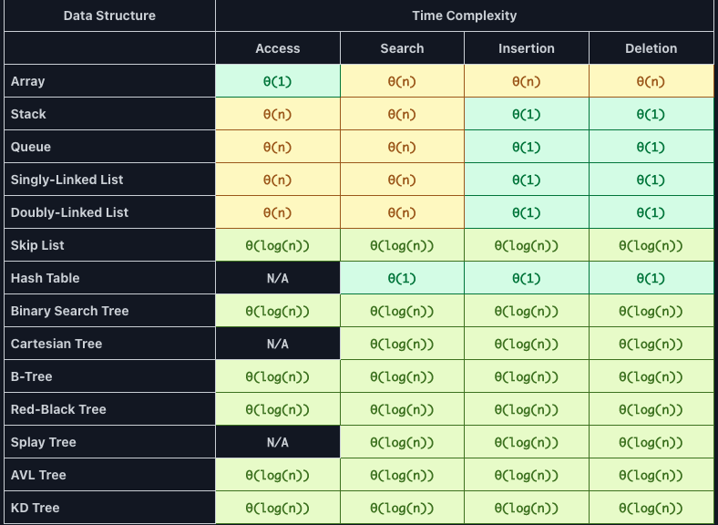
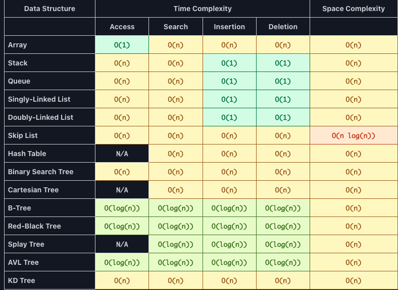
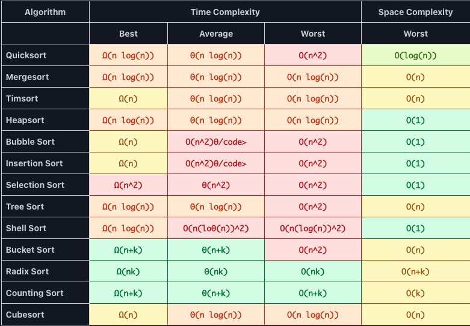

# Asymptotic analysis.

	Is a method of analyzing the running time of an algorithm by comparing it to simpler functions.

- It provides upper and lower bounds on the growth rate of the running time of an algorithm.
	- This allows us to estimate efficiency without the need to actually run it with large inputs.
- The most common forms of asymptotic analysis
	- Big-O Notation
	- Big-Ω Notation (Omega)
	- Big-Θ Notation (Theta)

`It is worth to mention that the actual running time of an algorithm can be influenced by many factors, such as hardware and software configurations. Even so, asymptotic analysis provide useful insights`

	
Big-O Notation

	
	
 

- Classes of functions :
	- Constant: O(1)
	- Linear: O(n)
	- Logarithmic: O(log n)
	- Linear Logarithmic: O(n log n)
	- Polynomial: O(n^2)
	- Exponential: O(2^n)
	- Factorial: O(n!)

	 

	

	
Data Structure Cases

	
	

	 

	

	
Data Structure Worst scenario Cases

	
	

	 

	

	
Sorting algorithm Cases

	
	

