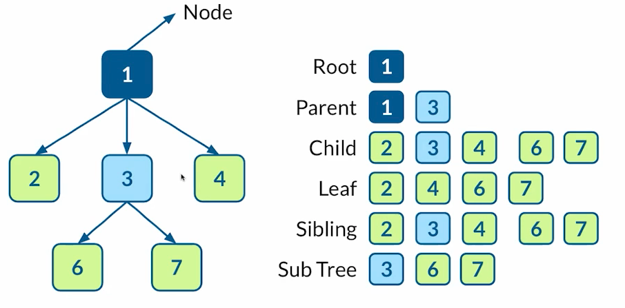

# Data Structures.

are a **collection of values**, relationship between them and methods to access the information or manipulate it.

## Resources
- [Data Structure Theory](https://github.com/trekhleb/javascript-algorithms).
- [Data structure Practice](https://leetcode.com/explore/learn/).

 

### Types of Data Structures

 

	
Arrays or Lists:

- are ordered collection of information addressed by indexes, There are arrays of type dynamics and statics:

	- statics: A specific amount of memory assigned because of number of data fixed (slots).
	- dynamics: Amount of memory undefined, this allows you to make modifications to them.

 

	
Hash Tables:

- associative data structure (key - value) that use a hash function to address the info.

	- This hash function is used to calculate the index where data is stored.
	- Data is stored in slots o buckets in the table, the number of them is arbitrary
		and it is hash function task determine in which slot a element will be placed.

- useful for search info in a big amount of data.

	- If we have a uniform allocation of hashes, the cost of obtaining any data
	it will be uniform too, since it will not depend on the number of items saved
	since with the hash function we can easily obtain the index.
	

- Its main difference with objects is that a key will be 
	converted into a hash trough a particular hash function.

- hash table collision: two keys or more could be allocated with the same hash.

 

	
Linked List:

- Organized node set that contains the value we need and a reference to the next node.

	- value: current node data.
	- Head: reference to first node.
	- Tail: reference to last node.
	- Next: reference to next node.
	- Prev: reference to previous node.

- Singly Linked List (one direction):

	- Each node save its value and the reference to the next node
	- In this type of list you can only advance in it forward.
		- So for get a previous value you need to start in the head again.
	

- Doubly linked list ( two directions)

	- Each node save its value and the reference to the next and prev node.
	- You can move forward and backward.

 

	
Stack:

- Represents a sequence of elements in a linear data structure format.

	- access to the elements is bases on LIFO principle.
		- LIFO means, Last In , First out
	- Operations.
		- Push: adds an element to the top.
		- Pop: removes an element from the top.
		- Peek: View the topmost item in the stack.

 

	
Queue:

- Represents a sequence of elements in a linear data structure format.

	- access to the elements is bases on FIFO principle.
		- FIFO means, First In , First out.

 

	
Trees:

-	A tree is a hierarchical data structure in which elements are organized into interconnected nodes [see image].
	- The top node is called the "root

 

	
Graph:

-	A graph is and structure of nodes also known as vertex that are connected by edges.
	- A graph can be directed or undirected.
		- Directed: A node directed to another node and so on.
		- Undirected: A node can be directed to another node and vice versa. no order is required.
	- A graph can be weighted or unweighted.
	- A graph can be cyclic or acyclic.
		- Cyclic: It is posible to go from a node to another node and return to the first node.
		- Acyclic: Going from a node to another node and return to the first node is not posible.

